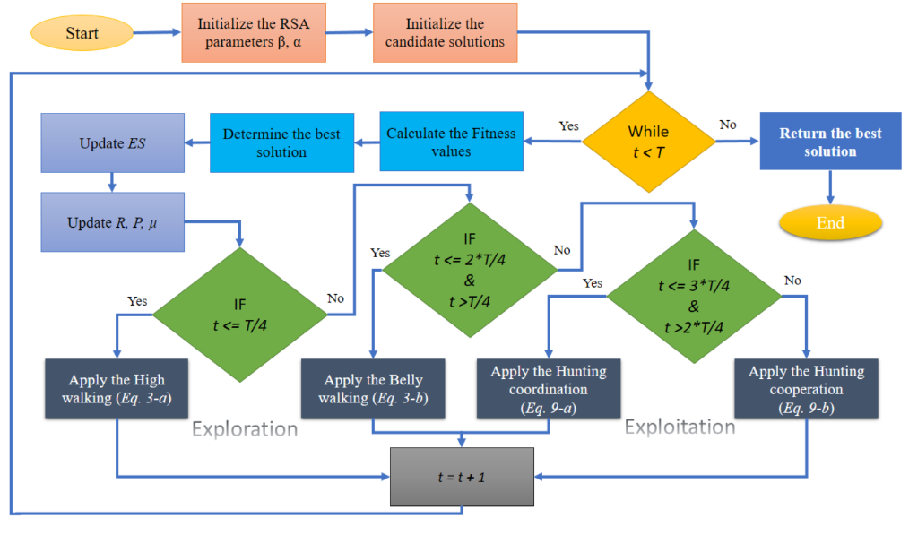
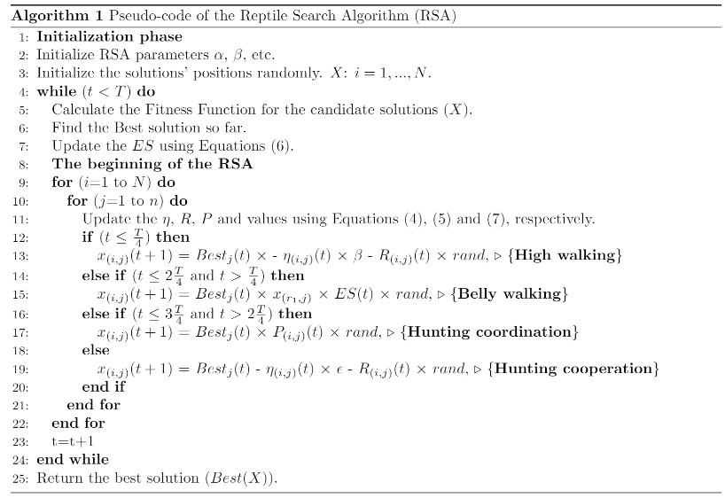

Inspired by https://github.com/laithabualigah/Reptile-Search-Algorithm-RSA-A-nature-inspired-optimizer.
A custom-made simulator using Pygame 2.1.2 (SDL 2.0.18) was used. Professor Marcos R. O. A. Maximo developed the simulator for the discipline CT-2013, Artificial Intelligence for Mobile Robotics, at the Aeronautics Institute of Technology(aka ITA).
To run the code, run the main.py files.
# Fluxogram of the Algorithm Used in the Paper
In the figure below, we present the fluxogram detailing the algorithm discussed in the paper. This visual representation aids in comprehending the steps and processes involved in the algorithm's execution. It serves as a valuable reference for understanding the methodology and implementation outlined in the paper. 
Caption: The flowchart illustrates the algorithm utilized in the paper.

# Pseudo-code of the Algorithm Used in the Paper
The figure below presents the pseudo-code detailing the algorithm discussed in the paper. 
Caption: The pseudo-code illustrates the algorithm utilized in the paper.

